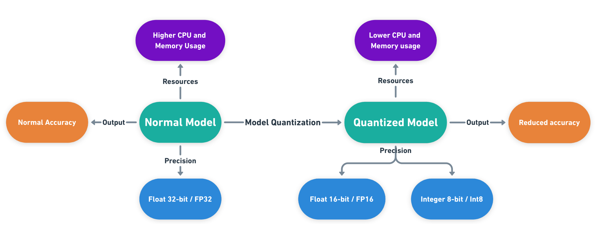
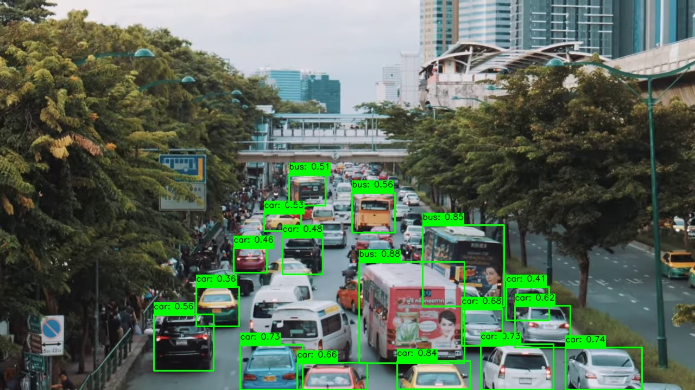
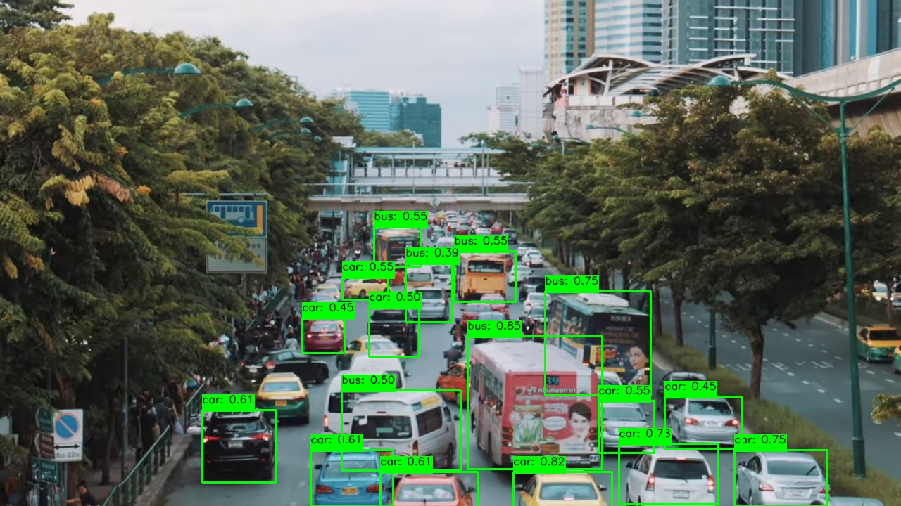

# Quantization-YOLOv8

## Table of Contents

- [Quantization](#quantization)
- [Performance](#performance)
- [Installation](#installation)


## Quantization

Model quantization is a technique used to reduce the precision of the numerical representations in a neural network. Typically, neural network models use 32-bit floating-point numbers to represent weights and activations. Quantization involves converting these high-precision numbers to lower-precision formats, such as 8-bit integers or 16-bit floating-point numbers.

## Performance
Static Quantized model provided faster inference speed with around 25% more FPS than the original Yolo model.
This too with similar kind of Confidence level.

|       |  |
|:-------------------:|:----------------------------------------:|
|      Yolov8n       |         Static Quantized Yolov8n         |


## Installation

1. Clone the repository:
   ```bash
   git clone https://github.com/majipa007/Quantization-YOLOv8.git
   
2. Install requirements.txt
   ```bash
   pip install -r requirements.txt
Then you are good to go.
